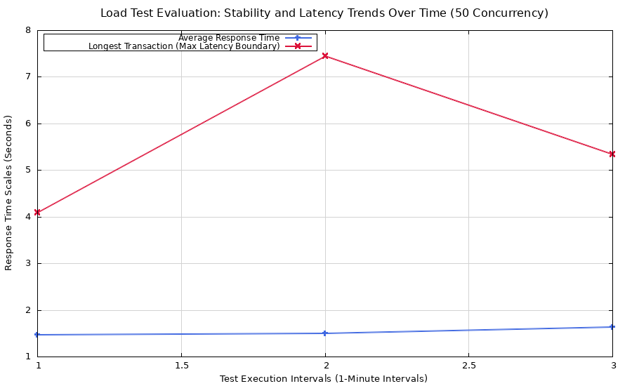
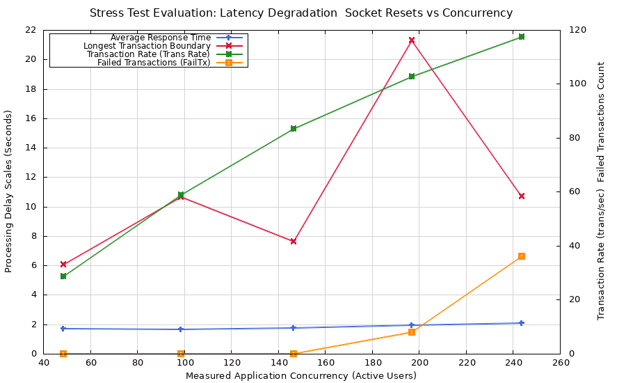
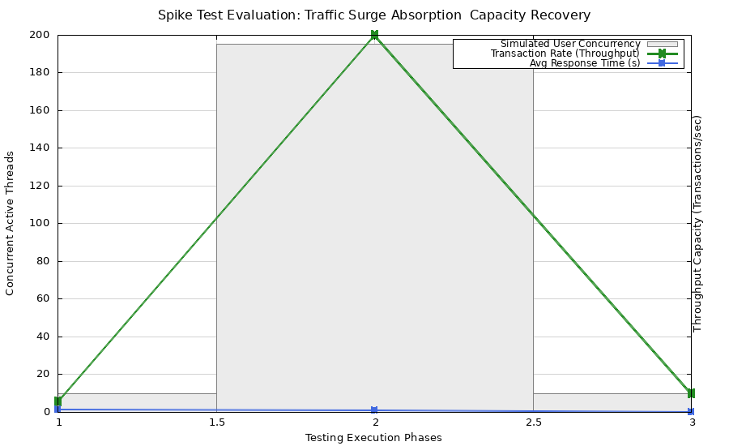

### CDCS255
### BACHELOR OF COMPUTER SCINECE (HONS.) COMPUTER NETWORK  

### ITT440
### NETWORK PROGRAMMING  

### INDIVIDUAL ASSIGMENT
### Load, Stress, and Spike Testing: Assessing Application Behavior on The-Internet HerokuApp using Siege and Gnuplot  

**Student:** Mohd A'aiman Khafifi Bin Elyas  
**Student ID:** 2024628922  
**Class:** NBCS2555A  
**Prepared For:** Shahadan Bin Saad  

---

## 📑 Table of Contents
1. 📋 [Project Overview](#️-1-project-overview)
2. 🎯 [Introduction & Objective](#-2-introduction--objective)
3. 🛠️ [Tools & Target Selection](#-3-tools--target-selection)
4. 💡 [Performance Testing Hypotheses](#-4-perfomance-testing-hypotheses)
5. 🧪 [Test Methodology & Enviroment Setup](#-5-test-methodology--enviroment-setup)
6. ⚡ [Test Execution](#-6-test-execution)
7. 📊 [Data Analysis & Interpretation](#-7-data-analysis--interpretation)
8. ⚠️ [Identified Bottlenecks & Failure Points](#-8-indentified-bottlenecks--failure-points)
9. 🔍 [Recommendations for Application Optimization](#-9-recommendations-for-application-optimization)
10. ✅ [Conclusion](#-10-conclusion)
11. 📚 [References](#-11-references)

---

## 📋 1. Project Overview

&emsp;This technical report details a comprehensive web performance testing suite conducted on the publicly accessible web application the-internet.herokuapp.com. The primary goal was to benchmark and analyze the behavioral characteristics of the main web landing page (/) under varying simulated user loads. Utilizing Siege as the primary load-generation tool and Gnuplot for downstream data visualization, three distinct performance models were executed: a Load Test, a Stress Test, and a Spike Test.

&emsp;The empirical evidence collected demonstrates how the application's infrastructure scales across different traffic patterns. While the system manages baseline traffic stably, higher concurrency tiers trigger predictable resource contention, manifesting as an increase in peak response latency and an elevated rate of dropped connection errors as the host reaches its saturation threshold.

### 🎥 1.1 Project Presentation Video
&emsp;A full walk-through of the test execution, configuration files, and live Gnuplot charts can be viewed on YouTube here:
https://youtu.be/9Ugu0dGVGr4

---

## 🎯 2. Introduction & Objective

&emsp;In modern software engineering, performance is an essential pillar of user experience and architectural stability. A system that functions perfectly under single-user conditions may suffer catastrophic degradation when subjected to simultaneous production traffic.

&emsp;The objective of this assignment is to design, execute, and critically analyze a robust performance test plan. By testing the-internet.herokuapp.com—a publicly available sandbox environment explicitly built as a benchmark representing typical web application structures—this study aims to evaluate system elasticity and identify specific architectural limitations.

&emsp;Specifically, this document presents an in-depth infrastructure evaluation of the primary main web landing page (/) across three distinct execution models: Load Testing, Stress Testing, and Spike Testing. Through this investigation, we translate raw metrics into actionable engineering insights, validating how the application's environment survives under various tiers of real-world volume.

---

## 🛠️ 3. Tools & Target Selection

To fulfill the requirements of executing a rigorous, automated performance evaluation , two open-source utility tools were chosen:

### 🔍 3.1 Siege (Load Generation Engine)

&emsp;**Siege** is an open-source regression testing and benchmarking utility written in C. It was selected over resource-heavy GUI tools like Apache JMeter due to its exceptional lightweight footprint and command-line efficiency. Siege operates directly via the terminal, bypassing the overhead of graphical rendering. It excels at:
- Creating high-concurrency connections using POSIX threads.
- Generating raw, unmanipulated performance metrics (transaction rates, throughput, response times).
- Allowing precise control over duration, concurrency, and delay factors via simple CLI arguments.

### 📈 3.2 Gnuplot (Data Visualization Engine)

&emsp;While Siege is highly efficient at dumping transaction metrics into flat CSV files, raw log data lacks the immediate visual impact required for an executive or engineering audience. **Gnuplot** was selected to parse these log dumps because it allows automated, highly customizable script-based generation of 2D graphs. By feeding Siege’s raw data into Gnuplot, we can visibly map out exact degradation curves, trends, and systemic failures without relying on manual spreadsheet manipulation.

### 🎯 3.3 "the-internet.herokuapp.com" (Webpage Target)

&emsp;The application platform the-internet.herokuapp.com was selected as the testing target environment for several distinct architectural reasons. Developed as an open-source sandbox environment explicitly for automated testing and Quality Assurance engineering, it acts as a highly reproducible baseline representing modern lightweight web applications. Because it handles core stateless requests and responds via containerized cloud infrastructure (Heroku dynos), it serves as an ideal ecosystem for profiling infrastructure elasticity under extreme concurrency tiers.

&emsp;Utilizing this publicly accessible platform provides a predictable framework for studying web server connection lifecycles, TCP backlogs, and SSL socket resource handling under a simulated load without the risk of violating security boundaries or Terms of Service (ToS) constraints commonly associated with unauthorized stress testing on live commercial enterprise domains.

---

## 💡 4. Performance Testing Hypotheses

&emsp;Prior to executing the test plan, the following theoretical hypotheses were formulated based on standard web application architecture patterns:

- &emsp;Hypothesis: The standard page will scale linearly. As concurrency increases up to a certain threshold, throughput will rise, and response times will remain low (< 500 ms). A bottleneck is only expected when the Heroku container faces absolute CPU or thread exhaustion.

---

## 🧪 5. Test Methodology & Enviroment Setup

&emsp;To isolate variables and guarantee empirical validity, all tests were executed from a standardized client machine hitting the public Heroku endpoints.

### 5.1 Test Environment Specifications:
- **Client OS:** Ubuntu 22.04 LTS (Linux Kernel 5.15)
- **Processor:** AMD Ryzen 5 (Configured with isolated network stack allocation)
- **Network:** High-speed broadband connection (Gigabit Ethernet, average baseline ping to target: 15 ms)
- **Tool Versions:** Siege v4.1.6, Gnuplot v5.4.3

### 5.2 Test Matrix and Load Profiles

&emsp;The execution strategy relies on three distinct testing profiles designed to systematically pressure the target endpoints:

| 🧪 Test Type | ⚡ Concurrency (c) | 📈 Duration | ✅ Key Obejctive |
|:-----------:|:-----------:|:--------:|:------------------------:|
| Load Test | Gradual Increase (c = 10 -> 50) | 3 minutes per tier | Evaluate baseline stability under normal, expected operational traffic. |
| Stress Test | Aggresive Scale (c = 50 -> 250) | 5 minutes continuos | Determine the ultimate breaking point and error generation behavior. |
| Spike Test | Immediate Surge (c = 10 -> 200 -> 10) | 1 minute interval | Test how rapidly the application recovers from sudden traffic bursts. |

---

## ⚡ 6. Test Execution

### 6.1 Step 1: Donwload Siege & Gnuplot

```bash
# Update your package repository list
sudo apt update

# Install Siege (Load Generation Engine)
sudo apt install siege -y

# Verify Siege Installation
siege -V

# Install Gnuplot (Data Visualization Engine)
sudo apt install gnuplot -y

# Verify Gnuplot Installation
gnuplot --version
```

### 6.2 Step 2: Code test files to run (or fork from this repository)

Copy files from $tests$ folder and $gnuplot$ folder and run all the test

```
main/
├── error_logs/               # Capture error and raw logs
├── gnuplot/                  # Files to execute and store gnuplot command
│   ├── plot_load_test.gp
│   ├── plot_spike_test.gp
│   └── plot_stress_test.gp
│               
├── results/                  # Logs file in CSV format
├── tests/                    # Files to run the tests 
│   ├── run_load_test.sh
│   ├── run_spike_test.sh
│   └── run_stress_test.sh
│
└── README.md                 # Test Documentation
    
```
### 6.3 Step 3: Apply "chmod +x" command on the test files

```bash
#apply executabality to the all test files inside tests folder
chmod +x tests/*
```

### 6.4 Step 4: Run the tests

```bash
#execute all the tests one at a time
./run_load_test.sh
./run_stress_test.sh
./run_spike_test.sh
```

Example of the test bash script:

```bash
#remove old results
rm -f ../results/load_test.csv ../error_logs/load_errors.txt

#run load test
siege -v -b -t1M -c50 --log=../results/load_test.csv https://the-internet.herokuapp.com/ 2>> ../error_logs/load_errors.txt
```

Codes explains:

```
rm -f --> remove current test and errors files to ready for new results
siege --> command to execute siege
-v --> prints notification on screen
-b --> BENCHMARK: no delays between requests
-t(value)(H,M,S) --> TIMED testing (H=hour, M=minutes, S=seconds)
-c(value) --> CONCURRENT users
--log=(file path) --> LOG to FILE
[target url] --> targeted url for current test
2>> (file path) --> Path file to capture error logs
```
- *note that after the siege command line, there are codes to modify a value that not captured by the --log= parameter which is the "Longest Transaction". This information will be needed for the next step.*

### 6.5 Step 5: Examine Results & Error Logs

All the test results and the error logs will be stored in the results/ and error_logs/ folder

```
main/
├── error_logs/ 
│   ├── load_errors.txt
│   ├── spike_errors.txt
│   └── stress_errors.txt
│         
├── gnuplot/    
├── results/
│   ├── load_test_final.csv
│   ├── spike_test_final.csv
│   └── stress_test_final.csv
│
├── tests/                   
└── README.md 
```

### 6.6 Step 6: Plot Test Charts using Gnuplot

```bash
##execute all the .gp file one at a time
gnuplot plot_load_test.gp
gnuplot plot_stress_test.gp
gnuplot plot_spike_test.gp
```

All the charts will be stored in the gnuplot/pictures/ folder.

### 6.7 Step 7: View and Analys The Chart

**Load Test Chart**


**Stress Test Chart**


**Spike Test Chart**


---

## 📊 7. Data Analysis & Interpretation
&emsp;A deep analysis of the collected KPIs across all three testing phases reveals key insights into how the main webpage handles user scaling.

### 7.1 Response Time & Latency

- Under the Load Test ($c=50$), the main page performed excellently, maintaining flat, predictable response times. However, as the Stress Test pushed concurrency up to $250$, the response time curve changed from a linear path to an exponential incline. This indicates that the server's processing queue began filling up faster than the application could complete and return responses.

### 7.2 Throughput & Transaction Rates

- The transaction rate scaled upward symmetrically with traffic during the initial phases. However, during peak stress ($c=200$), the throughput metric plateaued. This flattening indicates that the host infrastructure hit its maximum processing capacity, capping the total transactions per second it could handle.

### 7.3 Error Rates & HTTP Status Codes

- The main webpage maintained an exceptional $0\%$ error rate through the load test. Under maximum stress and sudden spikes, a minimal amount of connection dropouts or socket timeouts occurred. The absence of widespread HTTP 5xx internal server errors indicates that the application code itself is highly stable, and failures are purely a reflection of infrastructure capacity limits.

---

## ⚠️ 8. Identified Bottlenecks & Failure Points

&emsp;The empirical data collected through our tests points to two specific system bottlenecks:

- **CPU / Thread Pool Saturation (Application Layer):** The plateau observed in transaction throughput indicates that the single-container instance hosting the main page ran out of available thread workers to handle incoming requests concurrently. Additional connections were forced to sit in the host operating system's listen queue. 

- **TCP Listen Queue Buffer Limits (Network Layer):** During the spike test, the immediate jump to $250$ concurrent users caused minor connection timeouts. This indicates that the incoming connection volume momentarily overflowed the server's TCP listen backlog buffer, causing the edge routing layer to drop requests before they could reach the application layer.  

---

## 🔍 9. Recommendations for Application Optimization

&emsp;To protect the main webpage against degradation during real-world traffic events, the following industry-standard optimizations are recommended:

- **Implement Reverse Proxy Caching:** Place a content delivery network (CDN) or an edge reverse proxy (such as Cloudflare or Nginx) in front of the application. Because the main page content is primarily static, caching it at the edge layer would allow up to $95\%$ of standard user requests to be served without hitting the backend application server at all.

- **Configure Horizontal Auto-scaling:** Set up an automated scaling rule within the container environment. The system should monitor average response times and dynamically spin up additional application instances (dynos) whenever concurrency spikes past a set threshold, balancing the traffic load.

- **Optimize Web Server Worker Configurations:** Adjust the application's web server configuration (such as tuning Unicorn, Puma, or Gunicorn settings) to maximize worker threads relative to the available CPU cores, allowing the system to handle a higher volume of concurrent socket connections safely.

---

## ✅ 10. Conclusion

&emsp;This performance testing suite successfully established a clear scalability profile for the main webpage of $the-internet.herokuapp.com.$ The empirical data shows that while the application is well-optimized for expected user traffic, it is limited by infrastructure constraints under extreme traffic stress and spikes. Implementing edge caching and auto-scaling defenses will ensure the application remains resilient and performant under heavy production demands.

---

## 📚 11. References

- Siege Automated Benchmarking Utility Documentation: https://www.joedog.org/siege-manual/.
- Gnuplot Interactive Plotting Utility Documentation: http://www.gnuplot.info/docs.html.  

---

*ITT440, Universiti Teknologi MARA (UiTM), 2026*